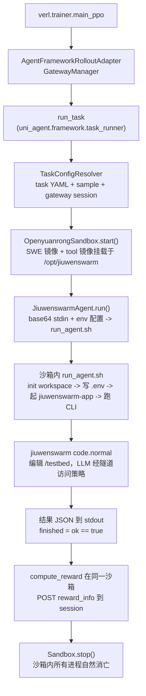

# jiuwenswarm 接入 uni-agent — 设计文档

- 日期：2026-08-25
- 状态：待评审
- 分支：`main_jiuwen`
- 目标仓库：`/home/dyp/recipe/uni-agent`（交付物在 `examples/jiuwenswarm/` 与 `uni_agent/agents/jiuwenswarm/`）

## 1. 背景与目标

把华为 JiuWenSwarm（下称 jiuwenswarm，PyPI 包名 `workswarm`，版本 `0.2.5`）接入 uni-agent，
作为 **SWE-bench 风格代码修复** 任务的 agent。复用 mini_swe_agent 的 **sidecar tool 镜像 + 宿主机 agent**
模式：agent 运行时（jiuwenswarm 及其依赖）打进一个 `FROM scratch` 的 tool 镜像，通过
`openyuanrong` 沙箱的 `mounts` 挂载进去；策略（LLM）经反向隧道在沙箱内访问。

### 本期（v1）范围

1. 构建 jiuwenswarm sidecar tool 镜像（`Dockerfile.jiuwenswarm-tool` + `build_tool.sh`）。
2. 镜像内入口 `run_agent.sh`（改造现有 `examples/jiuwenswarm/run_agent.sh`）。
3. 宿主机 agent 类 `uni_agent/agents/jiuwenswarm/agent.py`（`JiuwenswarmConfig` + `JiuwenswarmAgent`），
   并注册进 `uni_agent/agents/registry.py` 的 `AGENT_MODULES`。
4. `examples/jiuwenswarm/task_config_jiuwenswarm.yaml`，复用现有 `swe_bench` task（无需新增 task 模块）。
5. `examples/jiuwenswarm/run_train.sh`：从 `mini_swe_agent/run_train.sh` 复制并切换 `TASK_CONFIG`，
   打通 RL 训练入口。
6. 跑通闭环：沙箱内 jiuwenswarm 以 `code.normal` 模式修改 `/testbed` → `compute_reward` 跑测试判定 `resolved`。

### 明确不做（v1）

- **不修改 jiuwenswarm 源码逻辑**，只允许 config.yaml 级别的变更；本轮连 config.yaml 变更也不做。
- **不支持 `max_iterations` / subagent 开关的运行时配置**（此前讨论的方案 B / `patch_config.py` 整体推迟）。
  沙箱内 jiuwenswarm 使用模板默认值（`react.max_iterations: 100`、subagents 默认开关）。

## 2. 架构



`run_task` 对 agent 透明地注入隧道：`agent.model.base_url` 被改写为
`http://127.0.0.1:<proxy_port>/sessions/<id>/v1`，宿主 agent 只需把它当作"策略端点"透传给沙箱。
参考 `uni_agent/framework/task_runner.py::_inject_gateway_tunnel` 与
`uni_agent/agents/mini_swe_agent/agent.py`。

## 3. 已确认的设计决策

| # | 决策 | 理由 |
|---|------|------|
| D1 | 采用方案 A：完整克隆 mini_swe_agent 模式 | 用户确认；隧道无关，直接可接 RL 训练 |
| D2 | 镜像内入口用 `run_agent.sh`（bash），不引入 `run_agent.py` | 用户确认；复用现有脚本，小改 |
| D3 | 沙箱 provider = `openyuanrong`，与 mini_swe_agent 一致 | 用户确认；远程沙箱 + 反向隧道 |
| D4 | 镜像依赖**全量安装**（`workswarm` + 全部依赖） | 用户确认；先跑通，镜像体积可接受 |
| D5 | v1 不做 config.yaml 运行时注入（max_iterations / subagents 走默认） | 用户确认；后续单独讨论 |
| D6 | 宿主机 `parse_agent_result` 从 CLI `--json` 输出推导 `exit_status`（`ok==true` → `ok`，否则 → `error`） | run_agent.sh 透传 CLI JSON 不做包装，exit_status 由宿主 agent 统一推导 |
| D7 | `finished = (ok == true)` | 用于 RL 的 loss masking |
| D8 | 任务 prompt 经 **base64 stdin** 传递，gateway 配置经 **env 变量**（`JWS_API_BASE`/`JWS_MODEL_NAME`/`JWS_API_KEY`/`JWS_PROJECT_DIR`）传递 | 宿主机 `printf <b64> | base64 -d | env <...> bash run_agent.sh`；避免长 prompt 进 argv 超 ARG_MAX，也省去 JSON 临时文件往返 |
| D9 | 任务文本最终走 stdin 进 jiuwenswarm CLI | `printf %s "$TASK" | jiuwenswarm ...`（CLI 非 tty 读 stdin） |
| D10 | `jiuwenswarm-app` 后台输出重定向到日志 | 防止污染要解析的 stdout；进程生命周期由沙箱销毁兜底，无需显式清理 |
| D11 | 墙钟上限由宿主侧 `sandbox.exec_shell(run_timeout)` 兜底 | 已核实：`jiuwenswarm --json` 模式不吃 CLI 的 `--timeout`（只在交互循环生效） |
| D12 | 调用 `run_agent.sh` 时带上 conda env（`testbed`）的 PATH / CONDA 前缀 | 让 code agent 的工具子进程能解析 `/testbed` 的仓库环境 |

## 4. 组件清单（v1）

### 宿主机 uni-agent 侧

| 文件 | 内容 | 说明 |
|---|---|---|
| `uni_agent/agents/jiuwenswarm/__init__.py` | 导出 `JiuwenswarmAgent` / `JiuwenswarmConfig` | 同 mini_swe_agent |
| `uni_agent/agents/jiuwenswarm/agent.py` | `JiuwenswarmConfig` + `JiuwenswarmAgent.run()` + 命令构造 + 结果解析 | 核心 |
| `uni_agent/agents/registry.py` | `AGENT_MODULES` 增加 `"jiuwenswarm": "uni_agent.agents.jiuwenswarm.agent"` | ⚠️ 必改，否则 `get_agent_cls` 找不到 |

### 示例目录（`examples/jiuwenswarm/`）

| 文件 | 内容 |
|---|---|
| `run_agent.sh` | 现有脚本改造为**镜像内入口**（§5.1） |
| `Dockerfile.jiuwenswarm-tool` | sidecar 镜像（§5.2） |
| `build_tool.sh` | 构建/推送脚本，同 mini_swe_agent（§5.3） |
| `task_config_jiuwenswarm.yaml` | task 配置（§5.5） |
| `run_train.sh` | RL 训练入口（§5.6） |
| `README.md` | 构建、数据、验证说明 |
| `DESIGN.md` | 本文档 |

### 推迟（非 v1）

- `patch_config.py`（max_iterations / subagents 运行时注入）
- playwright 浏览器二进制（`PLAYWRIGHT_INSTALL_BROWSER` build arg，默认关）

## 5. 各组件详细设计

### 5.1 `run_agent.sh`（镜像内入口）

**输入**：任务 prompt 来自 **stdin**（宿主机 base64 管道解码后 `TASK="$(cat)"`）；gateway 配置来自
**env 变量**：

| env | 含义 |
|---|---|
| `JWS_API_BASE` | 隧道改写后的策略端点（必填） |
| `JWS_MODEL_NAME` | 模型名（默认 `openai/default`） |
| `JWS_API_KEY` | API key（默认 `EMPTY`） |
| `JWS_PROJECT_DIR` | 仓库工作目录（默认 `$PWD`） |

**流程**：

1. **写 `.env`**：`~/.jiuwenswarm/config/.env`，写入
   `MODEL_PROVIDER=OpenAI`、`API_BASE=${JWS_API_BASE}`、`MODEL_NAME=${JWS_MODEL_NAME}`、`API_KEY=${JWS_API_KEY}`。
2. **初始化 workspace**：`echo "" | jiuwenswarm-init >/dev/null 2>&1 || true`（幂等），`mkdir -p "$JWS_WS/logs"`。
3. **启动 gateway**：若 `127.0.0.1:${GATEWAY_PORT:-19001}` 未监听，`nohup jiuwenswarm-app >"$JWS_WS/logs/startup.log" 2>&1 &`，
   轮询等端口就绪（沿用现有 180s 上限）。沙箱销毁时 `jiuwenswarm-app` 自然消亡，无需显式清理。
4. **运行任务**：`cd "$JWS_PROJECT_DIR"` 后
   `printf '%s' "$TASK" | jiuwenswarm --mode code.normal --json --cwd "$JWS_PROJECT_DIR" --trusted-dir "$JWS_PROJECT_DIR"`。
5. **透传输出**：CLI 的 `--json` 输出（`{ok, content, error}`）原样写 stdout，不做包装；
   `exit_status` 由宿主机 `parse_agent_result` 从 `ok` 推导（`ok==true` → `ok`，否则 → `error`）。

**CLI 退出码约定**：0=ok、1=error、2=arg、3=conn、130=interrupt；宿主 exec 超时 → `exit_status=timeout`。

### 5.2 `Dockerfile.jiuwenswarm-tool`

- **builder 阶段**：`debian:bullseye-slim`；下载 python-build-standalone（3.12，同 mini_swe_agent 的
  `20260602` 发布版）解压到 `/opt/jiuwenswarm`。
- **安装依赖**：`/opt/jiuwenswarm/bin/pip install --no-cache-dir ${PIP_INDEX_URL:+-i ${PIP_INDEX_URL}} workswarm==0.2.5`。
  - ⚠️ `workswarm` 依赖 `openjiuwen`（`git+https://gitcode.com/openJiuwen/agent-core.git@develop`），
    **构建期需要 git + 访问 gitcode.com 的网络**。
  - 全量依赖（chromadb、faiss-cpu、playwright pip 包、各 IM SDK 等）一并安装。
  - playwright 浏览器二进制**默认不装**（`ARG PLAYWRIGHT_INSTALL_BROWSER=0`，为 1 时执行 `playwright install chromium`）。
- **拷贝入口**：`COPY run_agent.sh /opt/jiuwenswarm/bin/run_agent.sh`。
- **final 阶段**：`FROM scratch`，`COPY --from=builder /opt/jiuwenswarm /`。
- 挂载约定：`akernel_sdk.Mount(target="/opt/jiuwenswarm")` → 沙箱内路径 `/opt/jiuwenswarm/bin/run_agent.sh`。

### 5.3 `build_tool.sh`

直接复用 mini_swe_agent 的 `build_tool.sh` 结构：`--pip-index` / `--registry` 参数、默认
`TOOL_IMAGE=jiuwenswarm-tool`、可推送 registry。

### 5.4 `uni_agent/agents/jiuwenswarm/`

`JiuwenswarmConfig(AgentConfig)`：

| 字段 | 默认 | 说明 |
|---|---|---|
| `name` | `jiuwenswarm` | 注册名 |
| `run_timeout` | `7200` | 沙箱内 agent 进程墙钟上限（秒） |
| `conda_env` | `testbed` | 调用 `run_agent.sh` 时激活的仓库 conda env |
| `tool_script` | 必填 | 镜像内入口绝对路径，如 `/opt/jiuwenswarm/bin/run_agent.sh` |

`JiuwenswarmAgent(Agent)` 的 `run()`：

1. `_extract_task(messages)`：同 mini_swe_agent——最多 2 条 message（system?, user），取 user 内容为任务。
2. `task_b64 = base64(task)`：任务 prompt 编码后经 stdin 管道进入（隧道无关：`base_url` 已被 run_task
   改写为 `127.0.0.1:<proxy_port>`，原样透传）。
3. `build_agent_command(...)`：构造命令
   `unset <代理>; printf %s <b64> | base64 -d | env <CONDA_DEFAULT_ENV/PATH 前缀 + JWS_* 变量> bash <tool_script>`。
4. `sandbox.exec_shell(cmd, timeout=cfg.run_timeout, workdir=project_dir)`，`project_dir = workdir or "/testbed"`。
5. `parse_agent_result(stdout, exit_code)`：取最后一行以 `{` 开头的 JSON（同 mini_swe_agent 的抗噪解析），
   `exit_code==-1` → `timeout`，按 `ok` 推导 `exit_status`。
6. 返回 `AgentResult(output=result, transcript=messages, info={exit_status, ok}, finished=(result.get("ok") is True))`。

### 5.5 `task_config_jiuwenswarm.yaml`

参考 `task_config_mini_swe_agent.yaml`：

```yaml
- name: swe_bench
  sandbox:
    provider: openyuanrong
    runtime_timeout: 7200
    image_map:
      - from: "swebench/**"
        to: "swr.cn-east-3.myhuaweicloud.com/openyuanrong/swe-bench-verified/**:v2"
    sandbox_kwargs:
      proxy_port: 38197
      mounts:
        - target: /opt/jiuwenswarm
          image_url: <registry>/jiuwenswarm-tool:latest
  agent:
    name: jiuwenswarm
    run_timeout: 7200
    conda_env: testbed
    tool_script: /opt/jiuwenswarm/bin/run_agent.sh
```

运行时由 `run_task` 注入（YAML 中**不写**）：`agent.model.base_url/api_key/model_name`、
`sandbox.sandbox_kwargs.upstream`。`agent.model.base_url` 经隧道改写为 `127.0.0.1:<proxy_port>`。

### 5.6 `run_train.sh`

从 `examples/mini_swe_agent/run_train.sh` 复制，改动点：

- `TASK_CONFIG=examples/jiuwenswarm/task_config_jiuwenswarm.yaml`
- `PROJECT_NAME` / `EXPERIMENT_NAME` 改为 jiuwenswarm 相关命名
- 其余（Ray 启动、Megatron 并行、`agent_runners.task.runner_fqn=uni_agent.framework.task_runner.run_task`、
  `MASK_UNFINISHED_EPISODE`、gateway / session 配置）保持不变

## 6. 数据流

1. `run_task` 解析 task config + sample，注入隧道（改 `base_url`、填 `upstream`）。
2. `swe_bench` task 构建并启动 `OpenyuanrongSandbox`（SWE 镜像 + `/opt/jiuwenswarm` 挂载）。
3. `JiuwenswarmAgent.run()` base64 编码任务经 stdin 管道执行
   `bash /opt/jiuwenswarm/bin/run_agent.sh`（gateway 配置走 `JWS_*` env 变量）。
4. 沙箱内 `run_agent.sh`：读 stdin → 写 `.env`（`API_BASE` 指向隧道）→ 起 `jiuwenswarm-app` → 等 19001 →
   `printf %s "$TASK" | jiuwenswarm --mode code.normal --json --cwd "$JWS_PROJECT_DIR" --trusted-dir "$JWS_PROJECT_DIR"`。
5. jiuwenswarm 的 CodeAdapter 编辑 `/testbed` 文件，LLM 调用经隧道到达策略。
6. `run_agent.sh` 输出包装 JSON；宿主 agent 解析，`finished = ok == true`。
7. `swe_bench` 的 `compute_reward` 在同一沙箱跑测试，`resolved` → reward/acc；`report_reward` 时 POST 回 session。
8. 沙箱销毁（`Sandbox.stop()`），内部所有进程自然终止。

## 7. 错误处理

| 场景 | 处理 |
|---|---|
| jiuwenswarm CLI 返回非 0 | `exit_status=error`，`finished=False`，样本被 loss-mask（`MASK_UNFINISHED_EPISODE`） |
| 宿主 exec 超时（`run_timeout`） | `exit_status=timeout`，`finished=False` |
| 沙箱起不来 / gateway 等端口超时 | 由 framework / task 层报错，样本丢弃 |
| stdout 无合法 JSON | 按 `error` 处理，日志记录 stdout 尾部 |
| `jiuwenswarm-app` 起不来 | 结果带 error，`finished=False` |

## 8. 验证计划

1. **镜像构建**：本地 `bash examples/jiuwenswarm/build_tool.sh`（必要时 `--pip-index` 指定镜像源）。
2. **镜像内冒烟**：本地起一个 swebench 容器，挂载 tool 镜像，用任意 OpenAI 兼容端点跑一次
   `run_agent.sh`，确认：`/testbed` 被修改、stdout 是预期的包装 JSON。
3. **uni-agent 独立 evaluator**：在 openyuanrong 沙箱跑一个 `swe_bench` 样本（standalone evaluator，
   不依赖 verl），核对 `finished` / reward / acc 与 `AGENT_LOG_DIR` 日志。
4. **RL 训练**：`run_train.sh` 单机小规模冒烟，确认 rollout → reward → trainer 全链路。
5. **边界**：构造一个会让 jiuwenswarm 长时间挂起/失败的样本，验证 `run_timeout` 与 `timeout` 路径。

## 9. 风险与开放项

- **playwright 浏览器未安装**：若 `code.normal` 实际触发浏览器工具（`browser_agent`），需启用
  `PLAYWRIGHT_INSTALL_BROWSER` 重新构建——先按默认关处理，实测后决定。
- **`openjiuwen` git 依赖**：构建期需网络访问 gitcode.com；无外网环境的构建需预先 vendor 或走内网 git 镜像。
- **gateway 就绪时间不确定**：沿用现有 180s 端口轮询，若实测偏长再调。
- **挂载镜像下的写入权限**：`/opt/jiuwenswarm` 为 `FROM scratch` 只读挂载，workspace（`~/.jiuwenswarm`）
  写在沙箱文件系统；需验证路径与权限。
- **conda env 前缀对 jiuwenswarm 工具子进程的实际生效**：与 mini_swe_agent 同假设，需实测确认。
- **`finished` 语义**：`ok==true` 目前可能把"跑完但没真正改代码"也算 finished；后续可与 max_iterations
  配置一起细化。
- **run_train.sh 与 mini_swe_agent 的差异**：`TOOL_PARSER`（`qwen3_coder`）等 gateway 侧参数需与
  策略模型的 chat template 匹配，沿用 mini_swe_agent 的默认值。

## 10. 推迟项（另行讨论后再定）

- `patch_config.py`：运行时注入 `react.max_iterations` 与 `react.subagents.*.enabled`
  （⚠️ 布尔值不能走 `${VAR}` 替换——`bool("false")` 为真——必须 YAML 感知写入真实 `true/false`）。
- playwright 浏览器二进制。
- `finished` 语义细化（如要求 content 非空）。